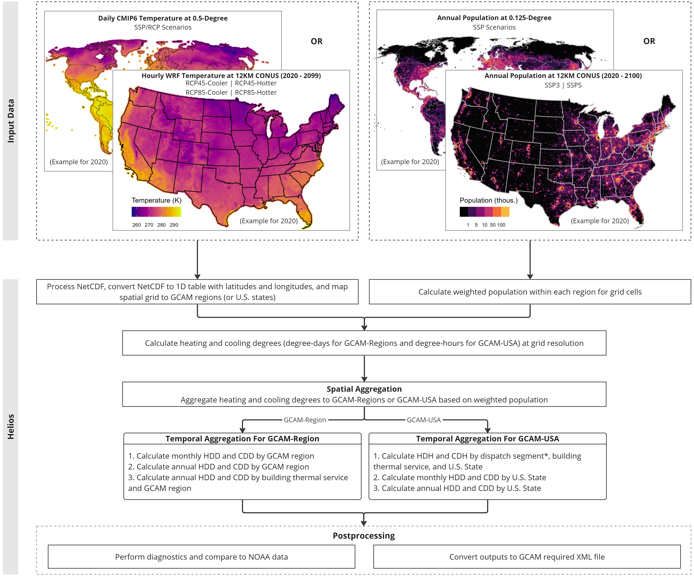

# Summary

`helios` is an open-source R package that estimates population-weighted heating and cooling degree-hours (HDH and CDH) and degree-days (HDD and CDD) at various temporal (e.g., energy dispatch segments, monthly, yearly) and spatial scales (e.g., U.S. states, global political regions) to inform electricity demand load in the Global Change Analysis Model (GCAM) [@calvin2019gcam] and the GCAM-USA with U.S. state-level details [@binsted2022gcam-usa]. As a GCAM-considerate package, `helios` is designed to be compatible with the temperature and population data at both fine and coarse resolutions to adapt to different spatiotemporal details needed by the continued GCAM development. `helios` integrates a pipeline of workflows that processes raw data, calculates heating and cooling degrees, visualizes performance diagnostics, and outputs results in various formats. The pipeline provides users with simple and reproducible functionality, without which R users would require experience on Geographic Information System (GIS) and processing large size of climate data in network Common Data Form (netCDF). There are two sources of widely-used climate data, or those with the same formats, that are compatible with `helios`: (1) hourly climate data with 12-km resolution that are dynamically downscaled with the Weather Research and Forecasting (WRF) model and projected using a thermal global warming (TGW) approach [@jones2022im3]; and (2) daily climate data with 0.5-degree resolution from Coupled Model Intercomparison Project (CMIP) that is bias-adjusted and statistical downscaled by the Inter-Sectoral Impact Model Intercomparison Project (ISIMIP). More broadly, `helios` standardizes methodology of heating and cooling degrees-hours and degree-days using publicly available data and advance the understanding of the impact of spatial and temporal temperature variability on building energy services.

# Statement of Need

`helios` was developed to meet the increasing research interests to exploring the spatial and temporal heterogeneity of climate impacts on sub-annual electricity demand from buildings. @ciscar2014integrated pointed out most integrated assessment models (IAMs) are unable to take advantage of the publicly available high resolution data to account for the impact of seasonal temperature change on energy system. To better fill in this gap, researchers have developed GCAM versions (e.g., GCAM-USA) to include power sector details at sub-annual and sub-national level [@wise2019representing]. For example, @khan2021impacts used GCAM-USA to show that the temperature-induced heating and cooling demands can significantly affect sub-annual electricity demand profiles and peak electricity loads. Understanding the seasonal dynamics of electricity demand and capacity within IAMs is of importance to support future infrastructure planning [@binsted2022electrified]. We develop `helios` to bridge the gap between high resolution data and global scale IAMs by facilitating the workflow in estimating population-weighted heating and cooling degrees. `helios` serves as a pre-processing tool of GCAM for researchers to capture the impact of sub-annual variation of different climate and socioeconomic scenarios on building energy demand.

# Design and Functionality

`helios` is designed to provide heating and cooling degrees to GCAM (or GCAM-USA) at two spatiotemporal scales: (1) HDH and CDH for the U.S. States for dispatch segments by building thermal service (refers to as `helios` for GCAM-USA); (2) annual HDD and CDD for GCAM 32 regions at 5-year time step by building thermal service (refers to as `helios` for GCAM-Regions). Beyond providing information for GCAM, `helios` also provides heating and cooling degrees at monthly time step. The use of `helios` requires users to provide information of the input files, such as climate model source for the climate data and variable name for temperature. For example, the ISIMIP-CMIP data uses "tas" and the WRF data uses "T2" as the temperature variable name. Figure 1 shows the workflow for both GCAM-USA and GCAM-Regions. More details can be accessed at `helios` [instruction](https://jgcri.github.io/helios/index.html) page on Github.

Working with climate data can be challenging due to large data size, different formats, and various spatiotemporal resolutions, data structures, and dimensions. While R is a great tool for data analysis and management, integrating functionality in `helios` to access different types of climate data in simpler form, calculate heating and cooling degrees with unified methodology, and ensure quality control of outputs can extend user's capability to manipulate climate data. There are five main functions provided `helios`:

(1) `helios::read_ncdf` processes complex climate data (e.g., netCDF) and converts to tabular data with latitude and longitude.
(2) `helios::read_population` processes population data and converts to the same resolution as the climate data from a certain model if needed.
(3) `helios::hdcd` calculates heating and cooling degree-hours and degree-days at various spatial and temporal scales.
(4) `helios::diagnostics` visualizes the outputs and compare with observation data if available.
(5) `helios::save_xml` converts outputs to XML file, which is a format required by GCAM to calculate building energy demand.

# Acknowledgements

This research was supported by the U.S. Department of Energy, Office of Science, as part of research in MultiSector Dynamics, Earth and Environmental System Modeling Program.

# References
