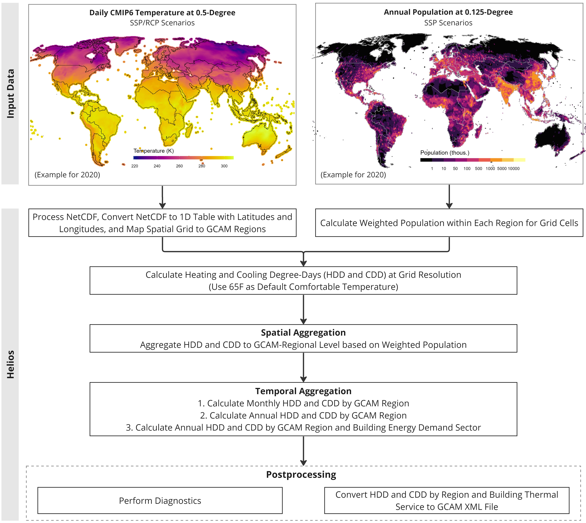

```{r setup, include=FALSE} 
knitr::opts_chunk$set(warning = FALSE, message = FALSE) 
```

<!-------------------------->
<!-------------------------->
# Input Data
<!-------------------------->
<!-------------------------->
<p align="center"> </p>

In this tutorial, we introduce how to use `helios` to calculate heating degree-days (HDD) and cooling degree-days (CDD) for the whole globe. The annual HDD and CDD with global coverage can be used in GCAM with 32 regions. `helios` currently supports climate data that has same format with ISIMIP statistical downscaling CMIP climate data. [Table 1](#table1) shows more details on the climate and population data supported by `helios` for GCAM-Regions.

<br />

<a name="table1"></a>
**Table 1:** Description of required input data in this tutorial.

| Specification | CMIP Climate Data | Population Data |
|---|---|---|
| Input Format | NetCDF File | NetCDF File |
| Spatial Resolution | 0.5 degree | No Limit |
| Temporal Resolution | Daily | Annual |
| Required Variable | Temperature `tas` (K) | Population (Capita) |
| Full Dataset Download | [ISIMIP](https://data.isimip.org/) | [Jones and O'Neill, 2020](https://sedac.ciesin.columbia.edu/data/set/popdynamics-1-8th-pop-base-year-projection-ssp-2000-2100-rev01) |
| Example Dataset | `helios::example_wrf_china_ncdf` | `helios::example_pop_china_ncdf` |

Please note that `helios` can process multiple climate NetCDF files with one population CSV file for each run. However, parallelizing grouped climate data can improve calculation efficiency for large dataset.

<br />

<!-------------------------->
<!-------------------------->
# Workflow
<!-------------------------->
<!-------------------------->
<p align="center"> </p>

`helios` includes 6 major steps in the workflow for global heating and cooling degree-days calculation ([Figure 1](#figure1)),

* Step 1: Process climate NetCDF at 0.5-degree resolution.
* Step 2: Calculate weighted population.
* Step 3: Calculate heating and cooling degree-days at grid resolution.
* Step 4: Calculate heating and cooling degree-days at monthly and annual scale for GCAM regions.
* Step 5: Calculate annual heating and cooling degree-days by GCAM region and building energy demand sector (This can be used as input to GCAM).
* Step 6: Post-process for diagnostic and convert to GCAM required format.


<br />

<p align="center"> </p>
<a name="figure1"></a>
<p align="left" style="font-size:14px;"> **Figure 1:** Helios workflow for global heating and cooling degree-days for general GCAM. </p>

<br />


<!-------------------------->
<!-------------------------->
# Method
<!-------------------------->
<!-------------------------->
<p align="center"> </p>

`helios` calculates heating and cooling degree-days for the Global implementation. [Table 2](#table2) shows more details of the method

<a name="table2"></a>
**Table 2:** Methods for calculating heating and cooling degree-days at different temporal scales.

| Temporal Scale | Spatial Scale |  Sector | Unit | Method |
|----------------|----------------|----------------|----------------|----------------------------------------------------------------|
| Daily | 32 GCAM Regions | Building Thermal Service* | Degree-days | 1. Calculate gridded heating degree-days (HDD) and cooling degree-days (CDD) as the difference between daily temperature and comfortable temperature (65F). <br /> $$HDH = T_i - T_{comfort}, \ if \ T_i < T_{comfort}$$ <br /> $$CDH = T_i - T_{comfort}, \ if \ T_i > T_{comfort}$$ <br /> where, $T_i$ is the daily temperature at a grid cell; $T_{comfort}$ is the comfortable temperature (assuming 65F globally). <br /> 2. Multiply the weighted population with the degree-day within the same grid cell. <br /> 3. Aggregate daily gridded HDD and CDD by GCAM region. |
| Monthly | 32 GCAM Regions | N/A | Degree-days | 1. Aggregate daily heating degree-days (HDD < 0) and cooling degree-days (CDD > 0) to monthly scale, respectively. |
| Annual |  32 GCAM Regions | N/A |Degree-days | 1. Aggregate monthly heating degree-days (HDD < 0) and cooling degree-days (CDD > 0) to annual scale, respectively. |

<br />

\* Building thermal service includes: commercial heating, commercial cooling, residential heating, and residential cooling.

<br />


<!-------------------------->
<!-------------------------->
# Examples
<!-------------------------->
<!-------------------------->
<p align="center"> </p>

## Example climate and population dataset

Due to large size of the climate data (netCDF file), `helios` provide spatially subsetted example dataset for demonstration purpose.

* **Climate NetCDF File**: `helios::example_wrf_china_ncdf` subsets a [100,110,30,40] longitude and latitude box within China (0.5-degree resolotion) from the global CMIP daily data. Data time ranges from 2015 to 2020.
* **Population NetCDF File**: `helios::example_pop_china_ncdf` subsets 121 0.5-degree grid cells within China from the 2020 population data under SSP1. The data is at 0.125 degree resolution.


<br />

## Calculate heating and cooling degree-days

The following example specifies the arguments for processing CMIP6 dataset. More information for the arguments can be found in (`helios::hdcd` Reference)[https://jgcri.github.io/helios/reference/hdcd.html].

* `ncdf_var = 'tas'` specifies climate variable to extract from the netCDF, which is temperature in this case.
* `model = 'cmip'` specifies the model used to produce the climate forcing data, which is CMIP6 model in this case.
* `spatial = 'gcam_region_32'` specifies we are  calculating the cooling and heating degree-days for 32 GCAM regions. This will produce outputs that can be used for general GCAM. For tutorial of using `helios` to calculate heating and cooling degree-hours for CONUS in GCAM-USA, please check out [GCAM-USA](vignette_gcam-usa.html) tutorial page.
* `temporal = 2020` specifies the time period (e.g., 2020) to extract from the dataset covering 2015 - 2020. Users can also specify multiple time period (e.g. `temporal = c(2017, 2018, 2019, 2020)`) if those time periods are within the time span of the climate and population dataset.


```{r eval=TRUE}
library(helios)

# example data: CMIP6 daily climate at 0.5 degree resolution
path_to_climate_ncdf <- helios::pkg_example('gfdl-esm4_r1i1p1f1_w5e5_ssp126_tas_global_daily_2015_2020_sub.nc')

# example data: population of 2020 at 0.125 degree resolution
path_to_population <- helios::pkg_example('ssp1_2020_sub.nc')

# Calculate heating and coolong degrees for GCAM regions (e.g., part of China in the example)
hdcd_china <- helios::hdcd(ncdf = path_to_climate_ncdf,
                           ncdf_var = 'tas',
                           model = 'cmip',
                           population = path_to_population,
                           spatial = 'gcam_region_32',
                           temporal = 2020,
                           reference_temp_F = 65,
                           folder = paste0(getwd(), "/output"),
                           diagnostics = F,
                           xml = F,
                           name_append = "",
                           save = F)
```

<br />

The output is a list containing three tables. All outputs are in degree-days.

* Heating and cooling **degree-days** by GCAM region and building thermal service.
* Heating and cooling **degree-days** by month for the Globe (part of China in the example).
* Heating and cooling **degree-days** by year for the Globe (part of China in the example).

```{r eval=TRUE}
# Heating and cooling degree-days by year and by building thermal service for GCAM regions
hdcd_bldg <- hdcd_china$hdcd_comb
knitr::kable(hdcd_bldg, 
             caption = 'Annual Heating and Cooling Degree-days by Building Thermal Service')

# Heating and cooling degree-days at monthly scale for GCAM regions
hdcd_monthly <- hdcd_china$hdcd_comb_monthly
knitr::kable(hdcd_monthly, 
             caption = 'Monthly Heating and Cooling Degree-days')

# Heating and cooling degree-days at annual scale for GCAM regions
hdcd_annual <- hdcd_china$hdcd_comb_annual
knitr::kable(hdcd_annual, 
             caption = 'Annual Heating and Cooling Degree-days')
```

<br />

***WARNING:** Please note that if users are following the example provided here, we use a spatial subset of CMIP6 input climate NetCDF data that covers 2015 - 2020. To get heating and cooling degrees for all 32 regions, users need to run the **global** climate NetCDF. This might propose computational challenge depending on the features of the computational devices used.

<br />

## Diagnostics

After getting the data table for heating and cooling degrees, users can perform diagnostics. The following example is only for demonstration of how to use `helios::diagnostic`.


```{r eval=FALSE}
# Perform diagnostic on monthly data
helios::diagnostics(hdcd_monthly = hdcd_monthly,
                    min_diagnostic_months = 6,
                    folder = paste0(getwd(), "/output"),
                    name_append = 'monthly')

# Perform diagnostic on segment data
helios::diagnostics(hdcd = hdcd,
                    spatial = 'states_us_49',
                    min_diagnostic_months = 6,
                    folder = paste0(getwd(), "/output"),
                    name_append = 'segment')
```


<br />

## XML file for GCAM

Finally, for GCAM users, `helios` can save the outputs by building thermal service to XML format, which is a required format for GCAM inputs. Set `xml = TRUE` in the `helios::hdcd` function will save the XML file to the output folder.

