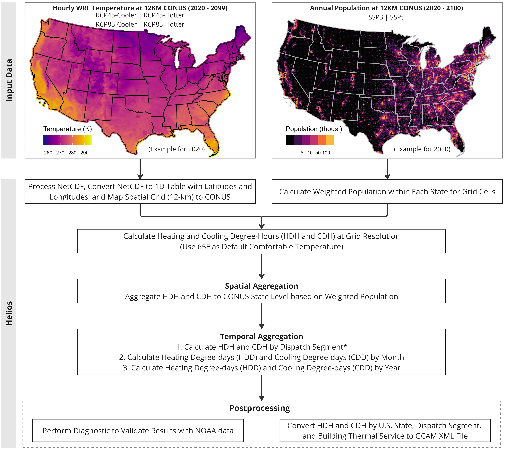

```{r setup, include=FALSE} 
knitr::opts_chunk$set(warning = FALSE, message = FALSE) 
```

<!-------------------------->
<!-------------------------->
# Input Data
<!-------------------------->
<!-------------------------->
<p align="center"> </p>

`helios` is an R package that calculates heating and cooling degrees based on high temporal and spatial resolution of climate data (hourly and 12km resolution) and population data (yearly and 12km resolution). In this tutorial, we introduce how to use `helios` to support GCAM-USA, where we use climate data over CONUS from WRF or those with the same format and spatial resolution. Data are available on NERSC if users have access. [Table 1](#table1) shows more details on the climate and population data supported by `helios`.


\* This method was developed for the GCAM-USA version as part of the Integrated Multisector, Multiscale Modeling (IM3) project.

<br />

<a name="table1"></a>
**Table 1:** Description of required input data in this tutorial.

| Specification | WRF Climate Data | Population Data |
|---|---|---|
| Input Format | NetCDF File | CSV File |
| Spatial Resolution | WRF Resolution: 12 x 12 km | WRF Resolution: 12 x 12 km |
| Temporal Resolution | Hourly | Annual |
| Required Variable | Temperature T2 (K) | Population (Capita) |
| Cluster Location | (NERSC) /global/cfs/cdirs/m2702/gsharing/tgw-wrf-conus | (NERSC) /global/cfs/cdirs/m2702/gcamusa/hddcdd/pop_1km |
| Full Dataset Download | N/A | (Pre-processed) https://zenodo.org/record/3756179#.Y5fLK3bMKUl |
| Example Dataset | `helios::example_wrf_usa_ncdf` | `helios::example_pop_usa_csv` |
| More Information | https://www.mmm.ucar.edu/models/wrf | https://www.mdpi.com/2071-1050/12/8/3374 |

Please note that `helios` can process multiple climate NetCDF files with one population CSV file for each run. However, parallelizing grouped climate data can improve calculation efficiency for large dataset.

<br />

<!-------------------------->
<!-------------------------->
# Workflow
<!-------------------------->
<!-------------------------->
<p align="center"> </p>


`helios` includes 6 major steps in the workflow for CONUS heating- and cooling-degrees calculation ([Figure 1](#figure1)),

* Step 1: Process climate NetCDF at 12-km resolution.
* Step 2: Calculate weighted population.
* Step 3: Calculate heating and cooling degree-hours at grid resolution.
* Step 4: Aggregate heating and cooling degree-hours by CONUS and building energy demand sector (This can be used as input to GCAM-USA).
* Step 5: Calculate heating and cooling degree-days at monthly and annual scale for CONUS.
* Step 6: Post-process for diagnostic and convert to GCAM required format.

***Note:** Dispatch segments are defined as 24 day and night segments in each month of the year (e.g., Jan-day, Jan-night, Feb-day, Feb-night, etc), plus a "super-peak" segment that has the top 10% of loads within a year for each grid region. Dispatch segments are specifically used in GCAM-USA.

<br />

<p align="center"> </p>
<a name="figure1"></a>
<p align="left" style="font-size:14px;"> **Figure 1:** Helios workflow for CONUS heating and cooling degree-days for GCAM-USA. </p>

<br />

<!-------------------------->
<!-------------------------->
# Method
<!-------------------------->
<!-------------------------->

`helios` calculates different units of heating and cooling degrees for different temporal scale. [Table 2](#table2) shows more details of the method

<a name="table2"></a>
**Table 2:** Methods for calculating heating and cooling degrees at different temporal scales.

| Temporal Scale | Spatial Scale | Sector | Unit | Method |
|----------------|----------------|----------------|----------------|----------------------------------------------------------------|
| Dispatch Segment | U.S. States | Building Thermal Service* | Degree-hours | 1. Calculate heating degree-hours (HDH) and cooling degree-hours (CDH) as the difference between hourly temperature and comfortable temperature (65F). <br /> $$HDH = T_i - T_{comfort}, \ if \ T_i < T_{comfort}$$ <br /> $$CDH = T_i - T_{comfort}, \ if \ T_i > T_{comfort}$$ <br /> where, $T_i$ is the hourly temperature at a grid cell; $T_{comfort}$ is the comfortable temperature (usually 65F for USA). <br /> 2. Multiply the weighted population with degree-days within the same grid cell. <br /> 3. Aggregate hourly HDH and CDH by dispatch segment, U.S. States, and building energy demand sectors. |
| Monthly | U.S. States | N/A | Degree-days | 1. Calculate daily mean temperature as the average of minimum and maximum daily temperature. <br /> 2. Calculate heating degree-days (HDD < 0) and cooling degree-days (CDD > 0) as the difference between mean temperature and comfortable temperature (65F). <br /> 3. Aggregate daily HDD (HDD < 0) and CDD (CDD > 0) by monthly, respectively. |
| Annual | U.S. States | N/A | Degree-days | 1.Aggregate monthly HDD (HDD < 0) and CDD (CDD > 0) by year, respectively. |

<br />

\* Building thermal service includes: commercial heating, commercial cooling, residential heating, and residential cooling.

<br />

<!-------------------------->
<!-------------------------->
# Examples
<!-------------------------->
<!-------------------------->
<p align="center"> </p>

## Example climate and population data

Due to large size of the climate data (NetCDF file), `helios` provide spatially subset of example data for demonstration purpose.

* **Climate NetCDF File**: `helios::example_wrf_usa_ncdf` subsets an approximately [-119.86,-118.18,37.99, 39.30] longitude and latitude box within the U.S. (12-km resolution) from the WRF hourly data. Data time ranges from 2020-01-01 01:00:00 to 2020-01-08 00:00:00.
* **Population CSV File**: `helios::example_pop_usa_csv` is population for 2020, which is geo-referenced to WRF grid cells.

<br />

## Read climate and population data

Users can use `helios` functions to read climate and population data and convert to tabular table with latitudes and longitudes.

* `helios::read_ncdf` accepts NetCDF format
* `helios::read_population` accepts NetCDF and CSV formats

```{r eval=TRUE}

# example data: WRF hourly climate at 12-km resolution
path_to_climate_ncdf <- helios::pkg_example('wrfout_d01_2020-01-01_01%3A00%3A00_sub.nc')

temperature <- helios::read_ncdf(ncdf = path_to_climate_ncdf,
                                 model = 'wrf',
                                 var = 'T2',
                                 time_periods = 2020)
```
```{r eval=TRUE, echo=FALSE}
library(dplyr)
library(kableExtra)
knitr::kable(temperature[1:10, ], 
             caption = 'Table. Temperature data extracted from WRF NetCDF.') %>% 
  kable_styling(bootstrap_options = 'striped', full_width = T, latex_options = 'HOLD_position') %>% 
  footnote(general = 'This only shows the first 10 lines of the example data.')
```

<br />

```{r eval=TRUE}

# example data: population of 2020 at same 12-km resolution as WRF
path_to_population <- helios::pkg_example('population_conus_ssp2_2020wrf_wgs84.csv')

population <- helios::read_population(file = path_to_population,
                                      time_periods = 2020)

```

```{r eval=TRUE, echo=FALSE}
knitr::kable(population[1:10, ], 
             caption = 'Table. Population data.') %>% 
  kable_styling(bootstrap_options = 'striped', full_width = T, position = 'center') %>% 
  footnote(general = 'This only shows the first 10 lines of the example data.')
```

<br />

## Calculate heating and cooling degrees

The following example specifies the arguments for processing WRF dataset. More information for the arguments can be found in (`helios::hdcd` Reference)[https://jgcri.github.io/helios/reference/hdcd.html].

* `ncdf_var = 'T2'` specifies climate variable to extract from the netCDF, which is temperature in this case.
* `model = 'wrf'` specifies the model used to produce the climate forcing data, which is WRF model in this case.
* `model_timestep = 'hourly'` indicates the temporal resolution of the climate forcing data, which is hourly in this case.
* `spatial = 'gcam_us49'` specifies we are only calculating the cooling and heating degrees within 49 states of USA. This will produce outputs that can be used for `GCAM-USA`. For tutorial of using `helios` for global 32 regions, please check out [GCAM-regions](vignette_gcam-regions.html) tutorial page.
* `time_periods = 2020` specifies the time period 2020 to include since the example data only covers 7 days in 2020.
* `dispatch_segment = TRUE` asks the model to output heating and cooling degree-hours by segment when the input data is hourly. In addition, these two arguments need to be specified as `model_timestep = 'hourly'` and ` spatial = 'gcam_us49'`, because the currently only GCAM-USA supports dispatch segment.

```{r eval=TRUE}
library(helios)

# example data: WRF hourly climate at 12-km resolution
path_to_climate_ncdf <- helios::pkg_example('wrfout_d01_2020-01-01_01%3A00%3A00_sub.nc')

# example data: population of 2020 at same 12-km resolution as WRF
path_to_population <- helios::pkg_example('population_conus_ssp2_2020wrf_wgs84.csv')

# Calculate heating and coolong degrees for CONUS (e.g., part of USA in the example)
hdcd_usa <- helios::hdcd(ncdf = path_to_climate_ncdf,
                         ncdf_var = 'T2',
                         model = 'wrf',
                         model_timestep = 'hourly',
                         population = path_to_population,
                         spatial = 'gcam_us49',
                         time_periods = 2020,
                         dispatch_segment = TRUE,
                         reference_temp_F = 65,
                         folder = file.path(getwd(), 'output'),
                         diagnostics = F,
                         xml = F,
                         name_append = '',
                         save = T)
```


<br />

The output is a list containing three tables. Please note the different units (degree-hours or degree-days) for different outputs.

* `hdcd_usa$hdcd_comb_gcam`: Heating and cooling **degree-hours** by dispatch segment for CONUS and by building thermal service. GCAM/GCAM-USA required format.
* `hdcd_usa$hdcd_comb_monthly`: Heating and cooling **degree-days** by month for CONUS (part of USA in the example).
* `hdcd_usa$hdcd_comb_annual`: Heating and cooling **degree-days** by year for CONUS (part of USA in the example).

<br />

**1. By GCAM-USA Dispatch Segment and Building Thermal Service**

```{r eval=TRUE}
# Heating and cooling degree-hours by dispatch segment and by building thermal service for CONUS
hdcd_segment <- hdcd_usa$hdcd_comb_gcam
```

```{r eval=TRUE, echo=FALSE}
knitr::kable(hdcd_segment, 
             caption = 'Table. Annual heating and cooling degree-hours by building thermal service') %>% 
  kable_styling(bootstrap_options = 'striped', full_width = T, position = 'center')
```

<br />

**2. By Month**

```{r eval=TRUE}
# Heating and cooling degree-days at monthly scale for CONUS
hdcd_monthly <- hdcd_usa$hdcd_comb_monthly
```

```{r eval=TRUE, echo=FALSE}
knitr::kable(hdcd_monthly, 
             caption = 'Table. Monthly heating and cooling degree-days') %>% 
  kable_styling(bootstrap_options = 'striped', full_width = T, position = 'center')
```

<br />

**3. By Year**

```{r eval=TRUE}
# Heating and cooling degree-days at annual scale for CONUS
hdcd_annual <- hdcd_usa$hdcd_comb_annual
```

```{r eval=TRUE, echo=FALSE}
knitr::kable(hdcd_annual, 
             caption = 'Table. Annual Heating and Cooling Degree-days') %>% 
  kable_styling(bootstrap_options = 'striped', full_width = T, position = 'center')
```

<br />

> **_NOTE:_** Please note that we use a spatial subset of WRF input climate NetCDF data as an example, which only covers 7 days. To get heating and cooling degrees for a complete year, users need to run climate NetCDF files using `helios` that cover the length of a year. For example, if each climate NetCDF is for 7-days, then user need to include about 52 climate NetCDF to cover a whole year of climate data. Then, users can use `helios::diagnostics` to create plots to check  heating and cooling degree behaviors throughout a year.

## Diagnostics

After getting the data table for heating and cooling degrees, users can perform diagnostics and compare with NOAA observations if data covers the U.S. The diagnostics create the following plots at segment and monthly time step:

* Heating and cooling degrees for each year
* Comparison of heating and cooling degrees among all years

Users can also use `helios::diagnostics` to visualize any heating and cooling degree data as long as they include those columns in the monthly data or the segment data: [subRegion, year, month/segment, HDCD, value]

<br />

**1. By Month**

Let's run `helios::diagnostics` to the example heating and cooling degree-days by month from 2020 to 2050.

```{r eval=TRUE, echo=FALSE}
# Heating and cooling degree-days by month
knitr::kable(helios::example_hdcd_monthly_usa[1:10,], 
             caption = 'Table. Example data for monthly heating and cooling degree-days from 2020 to 2050 with 5-year interval.') %>% 
  kable_styling(bootstrap_options = 'striped', full_width = T, position = 'center') %>% 
  footnote(general = 'This only shows the first 10 lines of the example data.')

```

If the data coverage is too short (e.g., less than 6 months), diagnostics will not create plot by default. Users can change the constraint on numbers of months in the data using argument `min_diagnostic_months` to enable diagnostics even with short data coverage. The followings show how to use diagnostics with example outputs of heating and cooling degrees at both segment and monthly time step. 

```{r eval=FALSE}
# Perform diagnostic on monthly data
helios::diagnostics(hdcd_monthly = helios::example_hdcd_monthly_usa,
                    min_diagnostic_months = 6,
                    folder = file.path(getwd(), 'output'),
                    name_append = 'monthly')
```

<br />

<p align="center"> </p>
<a name="figure2"></a>
<p align="left" style="font-size:14px;"> **Figure 2:** Diagnostics for monthly heating and cooling degree-days from 2020 to 2050. </p>

<br />

**2. By GCAM-USA Dispatch Segment**

Let's run `helios::diagnostics` to the example heating and cooling degree-hours by dispatch segment from 2020 to 2050.

```{r eval=TRUE, echo=FALSE}
# Heating and cooling degree-hours by dispatch segment
knitr::kable(helios::example_hdcd_segment_usa[1:10,], 
             caption = 'Table. Example data for heating and cooling degree-hours by Segment from 2020 to 2050 with 5-year interval.') %>% 
  kable_styling(bootstrap_options = 'striped', full_width = T, position = 'center') %>% 
  footnote(general = 'This only shows the first 10 lines of the example data.')

```


```{r eval=FALSE}
# Perform diagnostic on segment data
helios::diagnostics(hdcd_segment = helios::example_hdcd_segment_usa,
                    min_diagnostic_months = 6,
                    folder = file.path(getwd(), 'output'),
                    name_append = 'segment')

```

<br />

<p align="center"> </p>
<a name="figure3"></a>
<p align="left" style="font-size:14px;"> **Figure 3:** Diagnostics for heating and cooling degree-hours by dispatch segment from 2020 to 2050. </p>

<br />


## XML file for GCAM-USA

Finally, for GCAM users, `helios` can save the outputs by building thermal service to XML format, which is a required format for GCAM inputs. There are two ways to save `helios` output to XML file:

* Set `xml = TRUE` in the `helios::hdcd` function will automatically save the XML file to the output folder.
* Use `helios::save_xml` function.

```{r eval=TRUE}

helios::save_xml(hdcd_gcam = hdcd_segment,
                 folder = file.path(getwd(), 'output'),
                 name_append = 'wrf')

```
