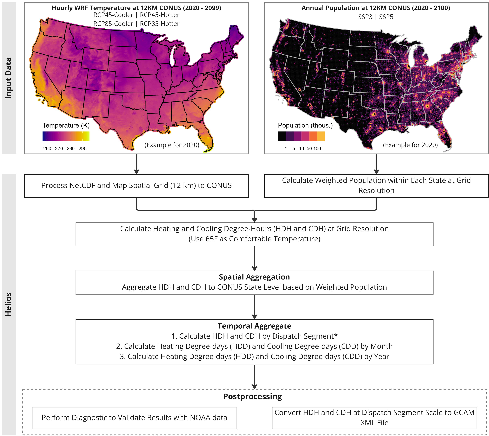

<!-------------------------->
<!-------------------------->
# Input Data
<!-------------------------->
<!-------------------------->
<p align="center"> </p>

`helios` is an R package that calculates heating and cooling degrees based on high temporal and spatial resolution of climate data (hourly and 12km resolution) and population data (yearly and 12km resolution). In this tutorial, we introduce how to use `helios` to support GCAM-USA, where we use climate data over CONUS from WRF or those with the same format. Data are available on NERSC if users have access. [Table 1](#table1) shows more details on the climate and population data supported by `helios`.

<br />

<a name="table1"></a>
**Table 1:** Description of required input data for CONUS.

| Specification | WRF Climate Data | Population Data |
|---|---|---|
| Input Format | NetCDF File | CSV File |
| Spatial Resolution | WRF Resolution: 12 x 12 km | WRF Resolution: 12 x 12 km |
| Temporal Resolution | Hourly | Annual |
| Required Variable | Temperature T2 (K) | Population (Capita) |
| Cluster Location | (NERSC) /global/cfs/cdirs/m2702/gsharing/tgw-wrf-conus | (NERSC) /global/cfs/cdirs/m2702/gcamusa/hddcdd/pop_1km |
| Available Download | N/A | (Pre-processed) https://zenodo.org/record/3756179#.Y5fLK3bMKUl |
| More Information | https://www.mmm.ucar.edu/models/wrf | https://www.mdpi.com/2071-1050/12/8/3374 |

Please note that `helios` can process multiple climate NetCDF files with one population CSV file for each run. However, parallelizing grouped climate data can improve calculation efficiency for large dataset.

<br />

<!-------------------------->
<!-------------------------->
# Workflow
<!-------------------------->
<!-------------------------->
<p align="center"> </p>


`helios` includes 6 major steps in its workflow ([Figure 1](#figure1)),

* Step 1: Process climate NetCDF.
* Step 2: Calculate weighted population.
* Step 3: Calculate heating and cooling degree-hours at grid resolution.
* Step 4: Aggregate heating and cooling degree-hours to CONUS States scale.
* Step 5: Calculate heating and cooling degree-days at monthly and annual scale.
* Step 6: Post-process for diagnostic and convert to GCAM required format.

***Note:** Dispatch segments are defined as 24 day and night segments in each month of the year (e.g., Jan-day, Jan-night, Feb-day, Feb-night, etc), plus a "super-peak" segment that has the top 10% of loads within a year for each grid region. Dispatch segments are specifically used in GCAM-USA.

<br />

<p align="center"> </p>
<a name="figure1"></a>
<p align="left" style="font-size:14px;"> **Figure 1:** Helios Workflow. </p>

<br />

<!-------------------------->
<!-------------------------->
# Method
<!-------------------------->
<!-------------------------->

`helios` calculates different units of heating and cooling degrees for different temporal scale. [Table 2](#table2) shows more details of the method

<a name="table2"></a>
**Table 2:** Methods for calculating heating and cooling degrees at different temporal scales.

| Temporal Scale | Unit | Method |
|----------------|----------------|----------------------------------------------------------------|
| Dispatch Segment | Degree-hours | 1. Calcualte heating degree-hours (HDH) and cooling degree-hours (CDH) as the difference between hourly temperature and comfortable temperature (65F). <br /> $$HDH = T_i - T_{comfort}, \ if \ T_i < T_{comfort}$$ <br /> $$CDH = T_i - T_{comfort}, \ if \ T_i > T_{comfort}$$ <br /> where, $T_i$ is the hourly temperature at a grid cell; $T_{comfort}$ is the comfortable temperature (usually 65F for USA). <br /> 2. Aggregate hourly HDH and CDH by dispatch segment. |
| Monthly | Degree-days | 1. Calculate daily mean temperature as the average of minimum and maximum daily temperature. <br /> 2. Calculate heating degree-days (HDD < 0) and cooling degree-days (CDD > 0) as the difference between mean temperature and comfortable temperature (65F). <br /> 3. Aggregate daily HDD and CDD by month. |
| Annual | Degree-days | 1. Calculate daily mean temperature as the average of minimum and maximum daily temperature. <br /> 2. Calculate heating degree-days (HDD < 0) and cooling degree-days (CDD > 0) as the difference from mean temperature to comfortable temperature (65F). <br /> 3. Aggregate daily HDD and CDD by year. |

<br />

<!-------------------------->
<!-------------------------->
# Examples
<!-------------------------->
<!-------------------------->
<p align="center"> </p>

Due to large size of the climate data (netCDF file), `helios` provide example dataset for demonstration purpose.

* NetCDF File: `helios::example_wrf_usa_ncdf` subsets 121 grid cells within USA from the WRF hourly data. Data time ranges from 2020-01-01 01:00:00 to 2020-01-08 00:00:00.
* CSV File: `helios::example_pop_usa_csv` is population for 2020, which is geo-referenced to WRF grid cells.

The following example specifies the arguments for processing WRF dataset.

* `ncdf_var = 'T2'` specifies climate variable to extract from the netCDF, which is temperature in this case.
* `model = 'wrf'` specifies the model used to produce the climate forcing data, which is WRF model in this case.
* `spatial = 'states_us_49'` specifies we are only calculating the cooling and heating degrees within 49 states of USA. This will produce outputs that can be used for `GCAM-USA`. For tutorial of using `helios` for global 32 regions, please check out [GCAM-regions](vignette_gcam-regions.html) tutorial page.
* `temporal = 2020` specifies the time period 2020 to include since the example data only covers 7 days in 2020.


```{r eval=FALSE}
library(helios)

hdcd_usa <- helios::hdcd(ncdf = helios::example_wrf_usa_ncdf,
                         ncdf_var = 'T2',
                         model = 'wrf',
                         population = helios::example_pop_usa_csv,
                         spatial = 'states_us_49',
                         temporal = 2020,
                         reference_temp_F = 65,
                         folder = paste0(getwd(), "/output"),
                         diagnostics = F,
                         xml = F,
                         name_append = "",
                         save = F)
```

<br />

The output is a list containing three tables. Please note the different units (degree-hours or degree-days) for different outputs.

* Heating and cooling **degree-hours** by dispatch segment for CONUS.
* Heating and cooling **degree-days** by month for CONUS.
* Heating and cooling **degree-days** by year for CONUS.

```{r eval=FALSE}
# Heating and cooling degree-hours at dispatch segment scale for CONUS
hdcd_segment <- output$hdcd_comb
head(hdcd_segment)

# Heating and cooling degree-days at monthly scale for CONUS
hdcd_monthly <- output$hdcd_comb_monthly
head(hdcd_monthly)

# Heating and cooling degree-days at annual scale for CONUS
hdcd_annual <- output$hdcd_comb_annual
head(hdcd_annual)
```

<br />

After getting the data table for heating and cooling degrees, users can perform diagnostics and compare with NOAA observations. The following example is only for demonstration of how to use `helios::diagnostic`.


```{r eval=FALSE}
# Perform monthly diagnostic
helios::diagnostics(hdcd_monthly = hdcd_monthly,
                    folder = paste0(getwd(), "/output"))
```


```{r eval=FALSE}
# Perform segment diagnostic
helios::diagnostics(hdcd = hdcd_segment,
                    folder = paste0(getwd(), "/output"))

```

<br />

***Note:** Please note that if users are following the example provided here, we use one WRF input climate NetCDF data, which only covers 7 days. Thus, the diagnostic will not show the full picture of heating and cooling degrees over a year. To get heating and cooling degrees for a complete year, users need to run climate NetCDF files using `helios` that cover the length of a year. For example, if each climate NetCDF is for 7-days, then user need to include about 52 climate NetCDF to cover a whole year of climate data. Then, users can use `helios::diagnostic` to create plots to check  heating and cooling degree behaviors throughout a year.
